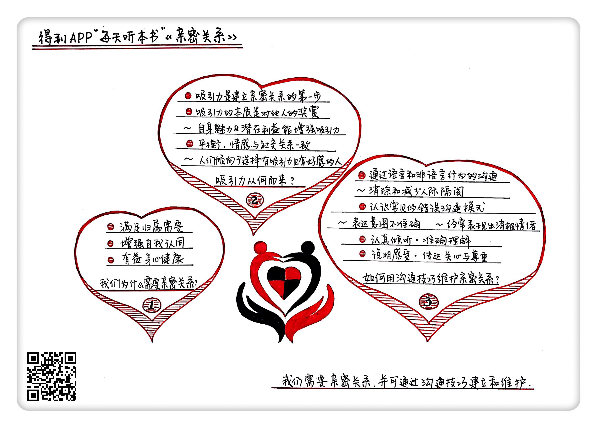

# 前言

你好，欢迎每天听本书。今天为你解读的是《亲密关系》。这本书的中文版大约 49 万字。我会用大约 21 分钟的时间，为你讲述书中精髓：我们为什么需要亲密关系，又应该如何建立和维护亲密关系。

我们都知道，人是社会性动物，“爱”与“被爱”是人的基本需求。然而，大多数人并不擅长处理两性关系，与伴侣亲近的同时总会产生这样那样的问题。于是，本来应该带来美妙体验、快乐享受的亲密关系，却往往带来的是失望、痛苦，甚至怨恨。

那么，是什么导致了这些现象呢？我们又应该如何去维护我们的亲密关系呢？这就是本书要探讨的问题。

本书的作者有两位，一位是罗兰·米勒，她是休斯顿州立大学的心理学教授。她在2008年获得了人际关系研究国际学会卓越教学奖。另一位作者是丹尼尔·珀尔曼，他是北卡罗来那州立大学教授，他从事家庭问题的研究长达30年，曾经担任过人际关系国际研究学会主席。

好了，介绍完这本书的基本情况和作者概况，那么下面，我就为你来详细讲述书中内容。

这本书主要讲了3个重点内容。

第一个重点，我们为什么需要亲密关系？

第二个重点，作为建立亲密关系的第一步，吸引力是从何而来的？

第三个重点，如何利用沟通的技巧维护你的亲密关系？

## 第一部分

我们就先来看看第一个重点内容：我们为什么需要亲密关系？

在社交生活中，和他人的关系是我们关注的中心内容。举个例子，监狱里有一种惩罚，把犯人单独监禁在一个囚室里，在几天的时间里，犯人都无法跟任何人接触。没有哪个犯人不怕被关禁闭，因为那实在是太痛苦了。那么，这是为什么呢？这是因为人类是非常社会化的动物，所以人需要和他人的紧密接触。和人群隔离会让人极度紧张，只有不断地和他人接触，我们才能感到舒适和安心。

不过，虽然没有人关我们禁闭，我们每天都会和很多人产生短暂的接触，但这对于我们来说仍然远远不够。人类需要亲密关系，因为亲密关系与普通的人际交往不同，亲密关系能满足我们的归属需要。那么，什么是归属需要呢？在美国心理学家马斯洛的需要层次理论中，归属需要是仅次于生理需要和安全需要的第三层次，它维护着我们内心的安宁，是我们人类的一种本能。也就是说，我们的幸福感很大程度上取决于归属需要得到了多少满足。为了满足归属需要，我们努力和他人建立并维持亲密关系。一旦我们的亲密关系出现危机，我们就会魂不守舍，这也充分表明了亲密关系对我们的重要性。

在书中，作者给出了一份研究报告，展示了亲密关系的缺失对人的影响。通过这份报告可以总结出一个规律，那就是缺乏亲密关系会损害人的身体健康。比如，当人孤独无伴时，免疫反应会变弱，更容易感冒；在人的一生中，朋友和爱人都很少的人，寿命往往更短，早逝的概率也比正常人高出两到三倍。也就是说，拥有良好的亲密关系不只是让我们感到幸福，还能让我们更加健康。

亲密关系不仅让我们的生活更加健康快乐，更重要的是，良好的亲密关系会让人拥有更高的自我认同，也就是会让人拥有高自尊，从而有益于人的身心发展。

自尊从何而来？很大程度上，我们的自尊来源于别人对自己的评价。如果一个人的人格和能力经常得到别人正面的评价，那么这个人就比较容易拥有高自尊；相应的，如果总是遭到质疑，这个人就会是一个低自尊的人。比方说，如果人们认为一个人对异性很有吸引力，那么这个人的自我感觉就会非常良好。

作者提到了这样一组实验， 实验者召集志愿者组成了若干兴趣小组，随后在每个小组中开除一些人。不同的是，在一部分小组中，被开除者是随机选定的，也没有给出任何解释；而在另一部分小组中，开除谁由组内成员投票决定。然后实验者去访问被开除者的心情，面对同样的结果，被投票开除的人明显要感觉更加糟糕。这就说明，我们对自己的评价极大地受到别人看法的影响。

人类的社会性决定了，如果别人都不喜欢我们，我们也很难喜欢自己。社会测量学的主导理论认为，自尊是人们的 “社会关系测量仪”，我们用自尊来衡量我们人际关系的质量。亲密关系会让我们感觉被认可，帮助我们修复低自尊，建立高自尊。拥有高自尊的人往往比低自尊者更加容易取得成功，因为他们面对困难和挫折时仍然可以充满自信，绝不气馁。

所以，我们现在知道了，亲密关系不但可以满足我们的归属需要，也会增加我们的自我认同，而缺少亲密关系会影响我们的身体健康，所以，我们需要亲密关系。

## 第二部分

上面为你讲述的就是本书的第一个重点内容：我们为什么需要亲密关系。说完这个，咱们接下来说第二个重点：作为亲密关系的第一步，吸引力是从何而来的。

要想和别人组建亲密关系，首先我们需要和人接触。那么，人和人之间是怎么开始接触的呢？作者说，要迈向亲密关系，第一步首先是要产生相互的吸引。

如何产生吸引力呢？作者说，吸引力的本质，就是对他人的奖赏。这是什么意思呢？影响吸引力的奖赏有直接和间接两种类型：直接奖赏指的是交际过程带来的直观的愉悦，对方的聪明、幽默和美丽都能给人直接奖赏。而间接奖赏指的就是人际关系中能给对方带来的潜在的利益，比如金钱、地位和名声。人能提供的直接或间接的奖赏越多，吸引力也就越强。

不过，这只是一个简单的吸引力模型，而实际情况要远比这复杂得多。事实上，别人对我们的吸引力不仅取决于他们的魅力，更与我们自己的需求和偏好有很大关系。也就是说，别人对我们是否有吸引力，不仅取决于他是谁，更取决于我们是谁。

比如说，相像的人彼此之间会产生吸引力。当我们遇到一个与我们相像的人，我们发现彼此有同样的背景、兴趣和品位，我们就会感到快乐。可以说，人际吸引最基本的原则之一就是相像。

而在亲密关系中更是如此。一对伴侣的共同点越多，彼此就越喜欢。而且，人并不会对这些共同点感到厌倦，就算他们彼此再相像，都不会使吸引力下降。 也就是说，两个人越像，就会越喜欢彼此。

另外，人与人互相吸引，还有一个很重要的因素，就是平衡。那么，什么是平衡呢？平衡就是说，人希望自己的思想和感情能与社交关系保持一致。如果两个人彼此都喜欢对方，他们的感情可以说达到了“平衡”，如果两个人都讨厌对方，其实也是一种平衡状态，但如果某个人喜欢一个人而得到的回报却是厌恶，那就是一种不平衡状态。

在我们选择伴侣时，平衡就体现在我们往往会更倾向于喜欢我们的人。当然，在平衡之外，我们也会考虑到之前提到过的其它因素，比如说，有人喜欢我们，但是长得不好看，这样的人，我们可能不会喜欢他。同样，如果有人长得很好，但是根本不喜欢我们，我们也不会浪费自己的时间。我们最后会选择的伴侣会是长相过得去，也很可能接纳我们的人。

最后，以上这些只是吸引力的基础。而互相吸引要变成亲密关系，还需要两方面的增幅。也就是说，既然吸引力的本质是对他人的奖赏，那么只要增强这种奖赏的程度和频率就可以增加吸引力。

于是，在人际交往中，我们和他人的距离越近，彼此间的吸引力给我们带来的奖励价值也就越高，比如说，大学生和室友的关系往往要比其他同学更加亲密。而另一方面，人与人之间的接触越多，就越能增加彼此的喜欢程度。心理学上有一个说法叫曝光效应，指的就是人们对他人或事物的态度会随着接触次数的增加而变得更加积极。

讲到这我们知道了，吸引力是亲密关系的第一步，而吸引力的本质是对他人的奖赏。我们自身的魅力和我们能给别人的潜在利益都能为我们提供吸引力，而近距离频繁的接触能让人与人变得更加亲密。除此之外，两个相像的人更容易互相吸引，平衡的人际关系也能让人们对彼此更加有好感。

## 第三部分

好了，上面为你讲述的就是本书的第二个重点：作为亲密关系的第一步，吸引力是从何而来的。下面，来为你说说最后一个重点：如何利用沟通的技巧维护你的亲密关系。

在亲密关系中，沟通是极其重要的一个部分，它看似简单而普遍。我们往往以为沟通就是说话，但实际上，沟通的过程要比我们意识到的复杂得多。

我们选择与某人沟通，是因为我们希望向对方传递信息来表达我们的意图。问题在于，我们的意图隐藏在我们的意识中是秘密的，只有我们知道它是什么。要想把它传达给对方，我们就必须先把它组织成公开的语言或非语言信息。

问题的关键是，从我们的意图到对方的理解，这中间会经过太多环节，于是就有可能产生错误或误解。我们往往以为自己的表达会造成我们所期望的影响，而实际上，我们很少有机会确切地知道它到底起到了怎样的效果。我们的意图和对方的理解往往有所出入，这就产生了人与人之间的隔阂。在亲密关系中，这种隔阂不仅会使双方感到不满，还会妨碍亲密关系的发展。

举个例子，一个害羞的男生决定鼓起勇气向某位女同学表白自己的爱慕之情。于是在下课时间他去找这位女同学闲聊，他天真又胆怯地试探这个女同学，问她周末有什么安排。这时男同学已经紧张得面红耳赤了，只能尴尬地东张西望。他认为自己的示爱意图已经无比明显了，希望得到对方热情的回应。然而，我们的女主人公却并没有意识到男同学对约会的暗示，只是说要为了接下来的考试做准备。于是，男同学认为自己清楚利落的示爱遭到了对方冷漠的拒绝，他决定不再做尝试，要和女同学保持距离，而这位女同学永远都不会知道发生了什么。

通过这个例子我们可以发现，人际隔阂是如此的容易发生，在交往中人们总是很难清楚地了解对方的真实意图。那么，怎样才能消除人际隔阂呢？我们已经知道，因为我们在表达和理解的过程中都会产生偏差，所以，要消除人际隔阂，就要利用沟通技巧来最小化这种偏差。

要想知道怎样才能最小化沟通之间的偏差，就要了解沟通会用到哪些方法。那么，下面我就来给大家介绍一下都有哪些沟通方法。

在沟通过程中，我们会用两种行为表达自己，就是语言行为和非语言行为，只要在这两种行为中尽可能消除不清楚、不准确的成分，就能有效地减少人际隔阂。

我们先来了解非语言行为。首先，和语言行为一样，非语言行为也具有提供信息的作用，它可以展示出人们的情绪状态和真实意图。比如，有时我们和别人开玩笑，会说出非常冒犯人的话来。而这时如果对方要判断我们是否有敌意，我们说话的音调、节奏和面部表情就成了关键的线索。正是我们夸张的语调和带有笑意的表情，让对方理解我们是在开玩笑。非语言行为的这一功能至关重要，所以我们才会在网上聊天时使用emoji来模仿人们的面部表情，从而表达自己的真实意图。

非语言行为可以表露出人们对彼此的兴趣，常常在一开始就决定了人们的沟通能否进行下去。比如，你兴致勃勃地向伴侣讲述自己的想法，却发现对方根本没有在看着你，你就会立刻感到沮丧甚至愤怒。如果伴侣任何一方对非语言行为不加注意，就可能会产生很多误解，也会降低亲密关系中的幸福感和满意度。

而积极的非语言互动，可以让沟通的双方时刻感受到彼此的情绪，让人可以准确地找到对方的兴趣点，让沟通变得更加具有奖励意义，从而使整个沟通过程流畅而愉快地进行下去。事实上，使用非语言行为其实是人类的本能，只要沟通双方都仔细看、耐心听、用心思索，他们在非言语沟通上就一定能做得更好。而且，相比陌生人，我们通常能更娴熟地解读亲密伴侣的非语言行为。所以在亲密关系中，非语言行为要比在普通人际交往中更加重要也更有意义。

我们已经了解了非语言沟通的重要性，那么在亲密关系中，语言沟通又有哪些意义和技巧呢？语言沟通是亲密关系中非常重要的一部分，它直接影响着亲密关系的发展。语言沟通实际上是在进行一种自我表露。所谓自我表露，就是向他人透露个人信息的行为。它是衡量亲密程度的重要指标，也就是说，只有两个人共同拥有一些私人的、相对秘密的信息，他们的关系才称得上是亲密。

当然，在实际生活中，大多数人际关系是以交换肤浅的信息为起点的，然后再逐渐转到更有意义的话题上。举个例子，当我们刚刚认识一个人的时候，只会随意地讨论一些不带感情色彩的话题：“你是哪里人？”“你是做什么的？”不过当这类肤浅的问题得到了具有奖赏价值的回应时，人们就会通过扩展谈话的内容来拉近彼此的距离。别人因为信任我们而进行自我表露，对我们来说是具有奖赏意义的。也就是说，伴侣彼此自我表露得越多，他们往往会越幸福美满。

可是有时我们说出了心里话，努力想和伴侣沟通，结果却事与愿违，这又是为什么呢？华盛顿大学的研究者们对此研究了30多年，终于找出了答案，并总结出了两种常见的错误沟通模式。

首先，不幸福的伴侣常常无法准确表达自己的意图。比如当他们抱怨某事时，很少能准确到位；相反，他们倾向于同时谈论好几个问题，以至于到了最后，反而忘记了最开始的时候想表达的是什么。于是，许多无关的事情把他们真正需要解决的问题掩盖了，使得沟通变得毫无用处又令人沮丧。举个例子，一位丈夫忘记了交电费导致家里停电，妻子就说，“哪有忘了这么一回事，都是因为你整天和你那帮狐朋狗友鬼混，对家里的事情从来不上心。”这样的谈话很容易偏离主题，从一个问题转到另一个问题，本来讨论的是忘交电费的事情，却转移到了丈夫的朋友圈子上，这样的沟通不仅无法解决问题，反而容易引发更多的矛盾和冲突。

另一种错误的沟通模式是，在沟通中经常性地表现出消极情绪。不幸福的伴侣常常会无视对方的抱怨，不仅不想办法解决，反而去讽刺挖苦对方，不断贬低和鄙视伴侣的人格。当亲密关系出现问题时，这种沟通模式会使问题变得越来越严重。而面对攻击，人通常的反应是自我保护，找各种借口推脱责任或者干脆攻击回去，于是沟通就演变成互相指责和谩骂，严重危害着亲密关系。

现在我们已经知道了，不准确的表达和消极情绪会严重降低我们的沟通质量，那么，怎么才能绕开这些沟通的陷阱呢？

为了尽量降低不准确表达的影响，我们在接收到对方的信息时，需要完成两个重要的任务。第一是要准确理解对方的意思，第二是要及时向对方传达关注和理解，让他知道我们在意他。这两个任务都可以通过我们接受到的信息来完成。如果我们用自己的话来重复一遍对方的意思，对方听到后，就有机会辨别我们的理解是否和他想表达的内容一致。同时，当我们复述对方的话时，也给了自己多一次机会去理解对方。这可能会使沟通看上去不太流畅，但它的确是一个避免争吵的好办法，因为这样做可以尽早地修正理解和表达中的偏差。

反过来说，我们还可以要求伴侣复述我们的话，来检验对方是否真的理解了我们的意图，这也能向对方传达我们的专注和兴趣，从而鼓励他更加投入沟通。

而要避免消极情绪，就需要我们尽可能地了解自己。那些对伴侣人格的批评和贬损，往往是小题大做，把一些生活中常见的小问题当成了严重的、不容易解决的难题。但是，只要我们能清楚明白、详细具体地指出我们眼中对方的问题，伴侣间的沟通就会变得清晰而融洽。这种方法就是行为描述，这样不仅能让伴侣正确理解我们的想法，还能把谈话重点集中在可处理的、单独的某个行为上，因为行为比人格更容易改变，事情也就变得更容易解决。

关于如何避免消极情绪，有一个技巧非常有效，那就是多用第一人称来说明自己的感受。也就是用“我”做开头，清楚明白地描述自己的情感反应。比如，当我们想说“你为什么看不到家里没有卫生纸了”，不如改成 “我需要你对我们的家庭有更多关注”。经常使用这种句式有助于我们辨识自己的情感，这对亲密关系的双方都有好处。这样做可以让我们意识到自己到底需要什么，从而更好地向伴侣表达，使沟通能够专注于问题本身。

努力传递清晰直接的信息，认真倾听，在争执发生时仍然保持礼貌和克制，这些都是构成良好沟通的重要因素，当然，最重要的在沟通中，我们要时刻明确地表现出我们对伴侣观点的关心和尊重。

如果人们在谈话中能够主动检验自己的知觉，并积极努力地去理解自己的伴侣，这种关心和体贴往往能得到伴侣极大的赏识和感激。而能运用这些沟通技巧的伴侣们，一般也都有着更加幸福的亲密关系。

努力练习并使用这些沟通技巧，准确地表达我们自己，耐心而尊重地倾听对方，时刻保持礼貌与尊重。说到底沟通是真诚和技巧缺一不可的艺术，良好的沟通能让我们的亲密关系变得更加健康，也能让我们的生活更加幸福。

总结

首先，我们说到了人类为什么需要亲密关系。因为亲密关系满足了我们的归属需要，而追求归属需要是人类的本能，亲密关系的缺失会严重影响我们的身心健康。而且，亲密关系有助于我们拥有高自尊，让我们更加容易成功。

其次，我们说到了作为亲密关系前提的吸引力。吸引力的本质是对他人的奖赏，个人魅力和潜在的利益都能产生吸引力，而相像的人彼此会更加吸引。然而，我们在选择伴侣时，还会考虑到关系的平衡，我们会倾向于选择对我们足够吸引又容易接纳我们的伴侣。

最后，我们说到了沟通的技巧。沟通有语言和非语言两种形式，它们相辅相成缺一不可。沟通对亲密关系的发展至关重要。而要想拥有良好的沟通，我们既需要准确的表达，同时还要尽量避免消极情绪对我们的影响。掌握了沟通的技巧，可以让我们的亲密关系更上一层楼。

撰稿：梁境心
脑图：摩西
转述：顾一菲